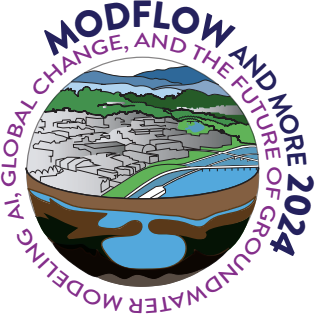

# MODFLOW 6 and FloPy: Take Your Modeling Skills to the Next Level
Training materials for the MODFLOW 6 and FloPy workshop offered at the [2024 Modflow and More Conference](https://igwmc.princeton.edu/modflow/) at Princeton University

## Location and Dates
* Princeton Univeristy, building and class room to be determined
* May 31 - June 1, 2024

## Course Description
MODFLOW 6 is the current version of MODFLOW released and supported by the USGS.  The program is under active development by the short course instructors and the broader hydrologic community.  This short course introduces participants to MODFLOW 6 and its growing simulation capabilities.  For each topic included in the short course, there will be a short lecture on the underlying concepts and implementation followed by a live demonstration.  Live demonstrations will use the Python language, Jupyter Notebooks, and the FloPy Package to create, run, and post-process MODFLOW 6 simulations. 

The following topics will be covered during the short course.
*	Getting started with MODFLOW 6 and FloPy
*	XT3D multi-point flux approximation for modeling aquifers with full three-dimensional anisotropy
*	Structured and unstructured discretization strategies (quadtree, triangular, and voronoi meshes, and local grid refinement)
*	Advanced packages (Multi-Aquifer Well, Streamflow Routing, Lake, Unsaturated Zone Flow, Water Mover, and Compaction and SUBsidence)
*	Constant and variable-density flow and solute transport
*	Introduction to the new Groundwater Energy (GWE) Model for MODFLOW 6
*	Introduction to the new Particle Tracking (PRT) Model for MODFLOW 6
*	Setting up and running parallel MODFLOW 6 simulations on laptops, desktops, and supercomputers
*	Using the MODFLOW Application Programming Interface (API) to couple with other models, create custom MODFLOW packages, and control MODFLOW during a simulation

## Intended Audience
This course is suited for groundwater modelers interested in learning about the USGS version of MODFLOW, its newer capabilities, and how to use FloPy to create and run simulations.  For attendees wanting to run live demonstrations, instructions for installing the required software on a laptop computer (Windows, Mac, and Linux operating systems will be supported) will be provided in advance of the course.  No previous experience with FloPy or Python is required, however, participants without any Python experience may benefit from additional preparation prior to the class.

## Instructors
* Chris Langevin, US Geological Survey
* Joe Hughes, US Geological Survey
* Alden Provost, US Geological Survey
* Martijn Russcher, Deltares
* Sorab Panday, GSI Environmental
* Eric Morway, US Geological Survey
* Josh Larsen, US Geological Survey
* Wes Bonelli, University Corporation for Atmospheric Research
* Michael Reno, University Corporation for Atmospheric Research

## Agenda

The following agenda is based on a start time each morning of 8:00 AM and an ending time each day of 5:00 PM.

### Monday, May 31, 2024

|Time      |Topic                            |Lead                        |
|----------|---------------------------------|----------------------------|
| 8:00 AM  |Introductions and Overview       |Langevin                    |
| 8:45 AM  |First FloPy Model                |Hughes                      |
|10:00 AM  |Mesh generation with FloPy       |Larsen                      |
|10:30 AM  |*BREAK*                          |                            |
|11:00 AM  |XT3D                             |Provost                     |
|12:00 PM  |*LUNCH*                          |                            |
| 1:15 PM  |Solute and Heat Transport        |Morway                      |
| 2:30 AM  |*BREAK*                          |                            |
| 3:00 PM  |Advanced Packages                |Hughes/Morway               |
| 5:00 PM  |ADJOURN                          |                            |

### Tuesday, June 1, 2024

|Time      |Topic                            |Lead                        |
|----------|---------------------------------|----------------------------|
| 8:00 AM  |Variable density flow            | Langevin/Panday/Morway     |
| 9:00 AM  |Particle Tracking in MODFLOW 6   | Bonelli/Provost            |
|10:00 AM  |Parallel MODFLOW                 | Russcher                   |
|10:30 AM  |*BREAK*                          |                            |
|10:45 AM  |Parallel MODFLOW (cont)          | Russcher/Hughes/Larsen     |
|12:00 PM  |*LUNCH*                          |                            |
| 1:15 PM  |MODFLOW API                      | Hughes/Russcher/Larsen     |
| 2:30 AM  |*BREAK*                          |                            |
| 3:00 PM  |MODFLOW API (cont)               | Hughes/Russcher/Larsen     |
| 4:00 PM  |NetCDF                           | Reno                       |
| 4:30 PM  |Future Directions and Wrapup     | All                        |
| 5:00 PM  |ADJOURN                          |                            |

## Software

This workshop consists of jupyter notebooks that use FloPy to create, run, and post-process MODFLOW models.  In order for workshop attendees to follow along and run the notebooks, software must be installed prior to the workshop.  Click [here](./SOFTWARE.md) for software installation instructions.

## Binder

If the software installation failed, it may be possible to run the jupyter notebooks using mybinder.org.  Click the button below to start an online version of the jupyter notebooks.

[![badge](https://img.shields.io/badge/launch-binder-579ACA.svg?logo=)](https://mybinder.org/v2/gh/langevin-usgs/modflow-training-princeton2024/HEAD)

## MODFLOW and More 2024

This workshop is part of the [MODFLOW and More Conference](https://igwmc.princeton.edu/modflow/).

